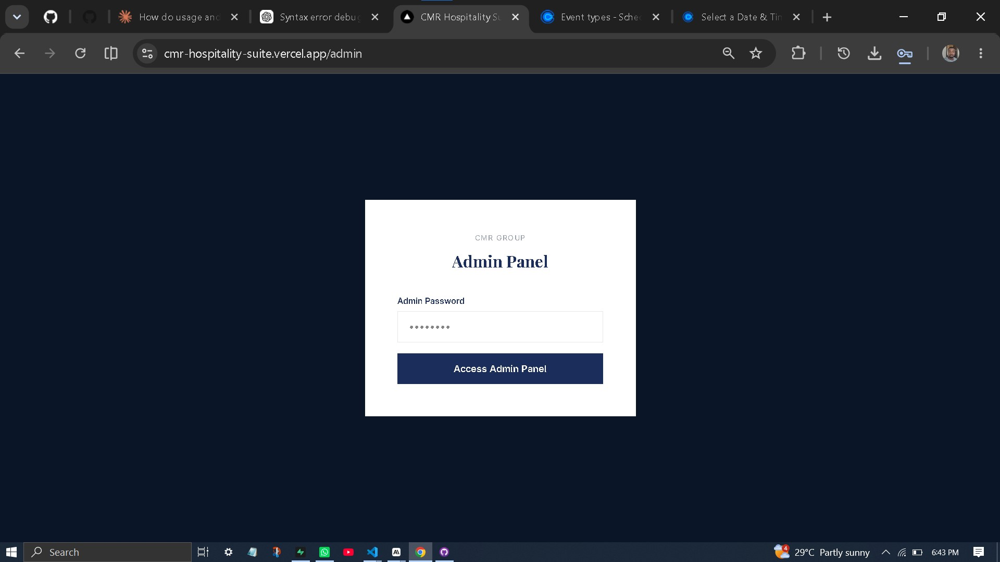
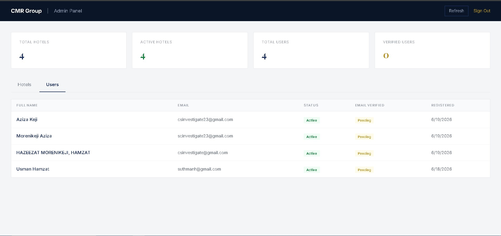
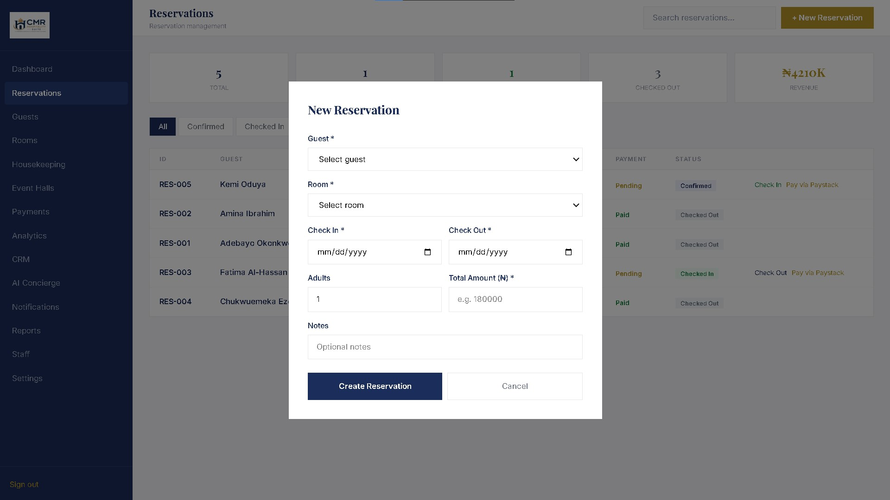
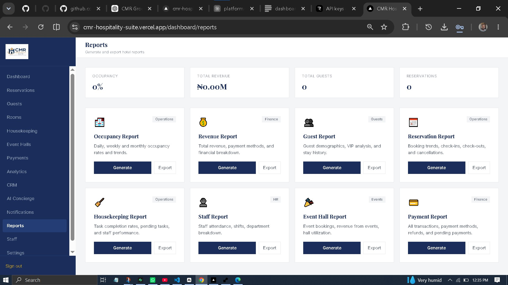
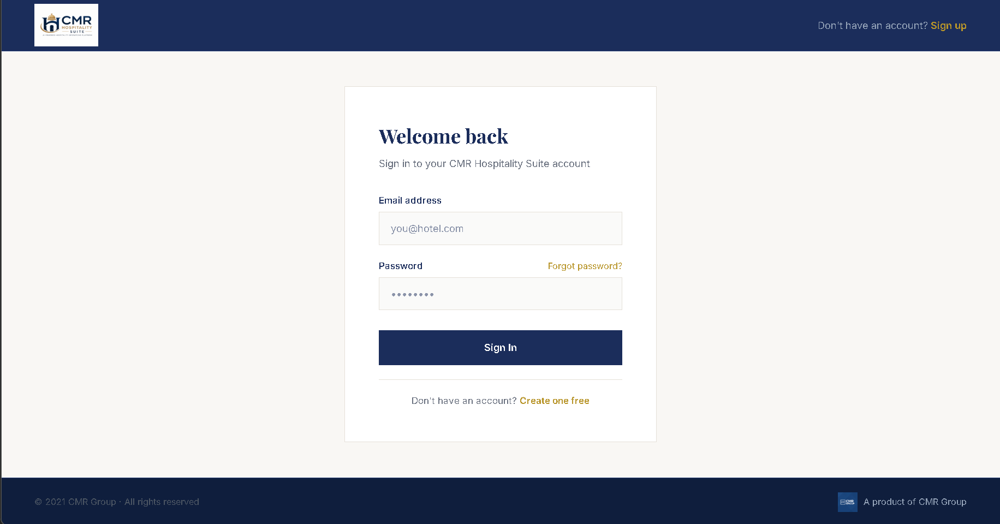

<p align="center">
  
</p>

<h1 align="center">CMR Hospitality Suite</h1>

<p align="center">
  <strong>AI-Powered Hospitality Management Platform</strong>
</p>

<p align="center">
  Modern hotel operations, reservations, payments, CRM, analytics, housekeeping, event management, and AI—all in one secure, cloud-based platform.
</p>

<p align="center">


</p>

## 🌟 Overview

**CMR Hospitality Suite** is a modern, cloud-based Hospitality Management System (HMS) developed by **CMR Labs**, the software engineering division of **CMR Group**.

Built for hotels, resorts, guest houses, serviced apartments, and event centres, the platform streamlines daily operations through a secure, scalable, and intelligent all-in-one solution.

Instead of relying on multiple disconnected tools, CMR Hospitality Suite unifies reservations, guest management, room operations, housekeeping, event management, payments, customer relationship management (CRM), business analytics, and AI-powered assistance into a single, centralized platform.

Designed with a multi-tenant architecture and enterprise-grade security, the platform empowers hospitality businesses to improve operational efficiency, deliver exceptional guest experiences, and make informed decisions through real-time insights.

---

## 🎯 Vision

To become Africa's leading hospitality technology platform by empowering hospitality businesses with intelligent digital solutions that simplify operations, enhance guest experiences, and drive sustainable growth through innovation.

---

## ✨ Key Features

### 🏨 Front Office Management

Manage every stage of the guest journey from booking to departure.

- Reservation Management
- Guest Management
- Check-in & Check-out
- Room Availability
- Room Type Management
- Online Payments
- Booking History

---

### 🛎️ Hotel Operations

Coordinate daily hotel activities from a unified operational dashboard.

- Housekeeping Management
- Staff Management
- Event Hall Management
- Event Bookings
- System Notifications
- Operational Reports
- Audit Logs

---

### 📊 Business Intelligence & Analytics

Monitor hotel performance with real-time insights and actionable metrics.

- Live Executive Dashboard
- Occupancy Analytics
- Revenue Analytics
- Guest Behaviour Insights
- Operational Performance Metrics

---

### 🤝 Customer Relationship Management (CRM)

Build stronger guest relationships and improve customer retention.

- Centralized Guest Database
- Customer Segmentation
- Guest Stay History
- Interaction Tracking

---

### 🤖 AI Concierge

Enhance staff productivity with an intelligent AI-powered hotel assistant.

- AI Concierge
- Operational Assistance
- Intelligent Knowledge Retrieval
- Secure Anthropic API Integration

---

### 🔒 Enterprise Security

Built with security, compliance, and scalability at its core.

- JWT Authentication
- Email Verification
- Password Reset
- Role-Based Access Control (RBAC)
- Multi-Tenant Architecture
- Audit Logging
- API Rate Limiting
- Secure Password Hashing (bcrypt)

---
---

## 🛠️ Technology Stack

CMR Hospitality Suite is built using a modern, scalable, and cloud-native technology stack designed for performance, security, and maintainability.

| Layer | Technology | Purpose |
|-------|------------|---------|
| **Frontend** | Next.js 16 | React framework for server-side rendering and modern web applications |
| | TypeScript | Type-safe JavaScript for scalable development |
| | Tailwind CSS | Utility-first CSS framework for responsive and consistent UI |
| **Backend** | FastAPI | High-performance Python web framework for RESTful APIs |
| | Python 3.11 | Backend programming language powering business logic |
| | SQLAlchemy | ORM for database modelling and query management |
| **Database** | PostgreSQL | Relational database for secure and reliable data storage |
| | Supabase | Managed PostgreSQL database with storage and backend services |
| **Authentication & Security** | JWT | Secure user authentication and session management |
| | bcrypt | Password hashing and credential security |
| **Payments** | Paystack | Secure online payment processing and transaction verification |
| **Email Services** | Resend | Transactional email delivery for verification, notifications, and password resets |
| **Artificial Intelligence** | Anthropic Claude AI | AI Concierge for intelligent hotel assistance and operational support |
| **Cloud Deployment** | Vercel | Frontend hosting with global CDN and automatic deployments |
| | Render | Backend API hosting *(planned migration to DigitalOcean App Platform)* |
| **Version Control** | Git & GitHub | Source code management, collaboration, and continuous version tracking |
---

## 🚀 System Modules

CMR Hospitality Suite is a comprehensive hospitality operations platform that combines modern 3D-inspired design, intelligent automation, and enterprise-grade management tools into a unified experience.

### 🌐 Public Experience
- 🏠 **Landing Website** – Modern marketing website with a premium 3D-inspired user interface
- 🔐 **Authentication** – Secure login, registration, email verification, and password recovery

### 🏨 Hotel Operations
- 📊 **Dashboard** – Live operational KPIs, occupancy, revenue, and business insights
- 🛏️ **Rooms** – Room inventory, availability, pricing, and photo management
- 🏷️ **Room Types** – Configure room categories, amenities, and pricing structures
- 📅 **Reservations** – Booking lifecycle, check-in, check-out, and reservation management
- 👤 **Guests** – Guest profiles, stay history, preferences, and VIP management

### 💼 Business Management
- 💳 **Payments** – Secure payment processing with Paystack integration
- 👥 **Staff Management** – Employee records, departments, shifts, and role assignments
- 🧹 **Housekeeping** – Task assignment, room status tracking, and maintenance coordination
- 🎉 **Event Halls** – Hall management, bookings, scheduling, and event operations
- 🤝 **CRM** – Customer relationship management, segmentation, and guest engagement

### 📈 Intelligence & Automation
- 📊 **Analytics** – Real-time occupancy, revenue, and operational analytics
- 🤖 **AI Concierge** – AI-powered hotel assistant built with Anthropic Claude
- 🔔 **Notifications** – System alerts, booking updates, and operational reminders
- 📑 **Reports** – Exportable operational and financial reports

### ⚙️ Administration & Security
- ⚙️ **Settings** – Hotel profile, branding, preferences, and system configuration
- 📝 **Audit Logs** – Complete activity tracking and compliance logging
- 🛡️ **Administration Panel** – Platform administration, user management, subscriptions, and system monitoring

## 🏗️ Project Architecture

CMR Hospitality Suite follows a modern cloud-native, multi-tier architecture that separates the presentation layer, business logic, data layer, and external services for scalability, maintainability, and security.

```text
                          🌐 Users
                               │
                               ▼
┌───────────────────────────────────────────────────────────────┐
│                     Presentation Layer                        │
│                                                               │
│          ⚡ Next.js 16 • TypeScript • Tailwind CSS            │
│                     (Hosted on Vercel)                        │
└──────────────────────────────┬────────────────────────────────┘
                               │
                         HTTPS / REST API
                               │
                               ▼
                ╔══════════════════════════════╗
                ║     FastAPI Backend API      ║
                ║                              ║
                ║  • Authentication            ║
                ║  • Business Logic            ║
                ║  • RBAC & Permissions        ║
                ║  • Multi-Tenant Isolation    ║
                ║  • Audit Logging             ║
                ╚══════════════════════════════╝
                               │
                               ▼
┌───────────────────────────────────────────────────────────────┐
│                     PostgreSQL Database                       │
│                        (Supabase)                             │
├───────────────────────────────────────────────────────────────┤
│ Hotels │ Users │ Rooms │ Guests │ Reservations │ Payments     │
│ Staff │ Housekeeping │ Event Halls │ CRM │ Audit Logs         │
└──────────────────────────────┬────────────────────────────────┘
                               │
        ┌──────────────────────┼────────────────────────┐
        │                      │                        │
        ▼                      ▼                        ▼
┌───────────────┐     ┌────────────────┐      ┌────────────────┐
│ Supabase      │     │ Resend         │      │ Paystack       │
│ Storage       │     │ Email Service  │      │ Payments       │
│               │     │                │      │                │
│ Logos         │     │ Verification   │      │ Initialize     │
│ Room Photos   │     │ Password Reset │      │ Verify         │
└───────────────┘     └────────────────┘      └────────────────┘
                               │
                               ▼
                    ┌────────────────────┐
                    │ Anthropic Claude   │
                    │ AI Concierge       │
                    └────────────────────┘
                               │
                               ▼
                    ┌────────────────────┐
                    │ Sentry Monitoring  │
                    │ Error Tracking     │
                    └────────────────────┘
```

### Architecture Layers

| Layer | Technology | Responsibility |
|-------|------------|----------------|
| **Presentation** | Next.js 16, TypeScript, Tailwind CSS | User interface and dashboard |
| **Application** | FastAPI, Python | Business logic, APIs, authentication, RBAC |
| **Data** | PostgreSQL (Supabase) | Persistent application data |
| **Storage** | Supabase Storage | Hotel logos, room images, future documents |
| **Payments** | Paystack | Payment processing and verification |
| **Email** | Resend | Email verification, password reset, notifications |
| **Artificial Intelligence** | Anthropic Claude | AI Concierge and intelligent assistance |
| **Monitoring** | Sentry | Error monitoring and production diagnostics |

---

## 📂 Repository Structure

```text
cmr-hospitality-suite/
│
├── frontend/                 # Next.js 16 frontend application
├── backend/                  # FastAPI backend services
├── database/                 # Database schema, migrations & seed scripts
├── docs/                     # Project documentation
│   ├── ROADMAP.md
│   ├── ARCHITECTURE.md
│   ├── DATABASE.md
│   ├── API.md
│   ├── INSTALLATION.md
│   ├── DEPLOYMENT.md
│   ├── SECURITY.md
│   ├── RBAC.md
│   └── CHANGELOG.md
│
├── scripts/                  # Utility and deployment scripts
├── tests/                    # Unit & integration tests
├── .github/                  # GitHub workflows and templates
│
├── README.md
└── LICENSE
```

---

# 🏗️ System Architecture

CMR Hospitality Suite follows a modern cloud-native, multi-tenant architecture designed for scalability, security, and maintainability.

### High-Level Architecture (3D)

<p align="center">
  
</p>

---

### Infrastructure Overview

```text
                         Internet
                             │
                             ▼
                    Vercel Edge Network
                             │
                Next.js Frontend (React)
                             │
                     Secure REST API
                             │
                             ▼
                    FastAPI Application
                             │
        ┌────────────────────┼─────────────────────┐
        │                    │                     │
        ▼                    ▼                     ▼
 PostgreSQL           Supabase Storage        Background Jobs
  (Supabase)          Logos • Images           (Future)

        │
        ├───────────────┬────────────────┬────────────────┐
        │               │                │                │
        ▼               ▼                ▼                ▼
   Paystack         Resend Email     Claude AI         Sentry
   Payments       Notifications      Concierge      Error Monitoring
```

---

# 📸 Product Preview

The screenshots below demonstrate the major modules available within CMR Hospitality Suite.



.png)
.png)
.png)
.png)
.png)
.png)
.png)




---

# 🚀 Installation

Complete installation instructions are available in the following documentation:

- 📘 **INSTALLATION.md** — Local development setup
- 📘 **DEPLOYMENT.md** — Production deployment guide
- 📘 **CONFIGURATION.md** — Environment configuration

---

# 📚 Documentation

Comprehensive project documentation is available inside the **docs/** directory.

| Document | Description |
|-----------|-------------|
| 📖 ARCHITECTURE.md | System architecture and infrastructure |
| 🗄 DATABASE.md | Database schema and relationships |
| 🔌 API.md | REST API reference |
| 🔐 RBAC.md | Roles and permissions |
| ⚙️ DEPLOYMENT.md | Deployment guide |
| 💻 INSTALLATION.md | Local installation |
| 🛡 SECURITY.md | Security architecture |
| 🧪 TESTING.md | Testing strategy |
| 🛣 ROADMAP.md | Product roadmap |
| 📜 CHANGELOG.md | Version history |

---

# 🗺️ Development Roadmap

Current project progress:

| Module | Status |
|---------|:------:|
| Authentication | ✅ |
| Dashboard | ✅ |
| Rooms | ✅ |
| Reservations | ✅ |
| Guests | ✅ |
| Payments | ✅ |
| Analytics | ✅ |
| CRM | ✅ |
| AI Concierge | ✅ |
| RBAC | ✅ |
| Audit Logs | ✅ |
| Subscription System | ✅ |
| Feature Gating | ✅ |
| Mobile Optimization | 🚧 |
| Guest Booking Portal | 🚧 |
| WhatsApp Integration | 🚧 |
| SMS Integration | 🚧 |

For the complete roadmap, see **ROADMAP.md**.

---

# 🔒 Security

Security is a core design principle of CMR Hospitality Suite.

Implemented features include:

- ✅ JWT Authentication
- ✅ Secure Password Hashing (bcrypt)
- ✅ Email Verification
- ✅ Password Reset
- ✅ Role-Based Access Control (RBAC)
- ✅ Multi-Tenant Data Isolation
- ✅ Audit Logging
- ✅ Rate Limiting
- ✅ API Authorization Middleware
- ✅ Secure AI Backend Proxy

Additional implementation details are available in **SECURITY.md**.

---

# 👨‍💻 Developed By

## CMR Labs

**CMR Labs** is the software engineering and artificial intelligence division of **CMR Group**.

Our mission is to design and build secure, scalable, and intelligent software solutions that transform how businesses operate through automation, artificial intelligence, and digital infrastructure.

---

# 📄 License

Copyright © **2026 CMR Group**.

All Rights Reserved.

CMR Hospitality Suite is proprietary software developed by **CMR Labs**.

No part of this software may be copied, modified, distributed, reverse-engineered, or used without prior written permission from CMR Group.

See the **LICENSE** file for licensing terms.

---

# 📬 Contact

🌐 **Website**  
*Coming Soon*

📧 **Email**  
*suthmanh@gmail.com*

💻 **GitHub Organization**  
https://github.com/CMR-Labs

---

<p align="center">
<strong>Built by CMR Labs</strong><br>
Creating intelligent software for the future of hospitality.
</p>

GitHub: https://github.com/CMR-Labs
